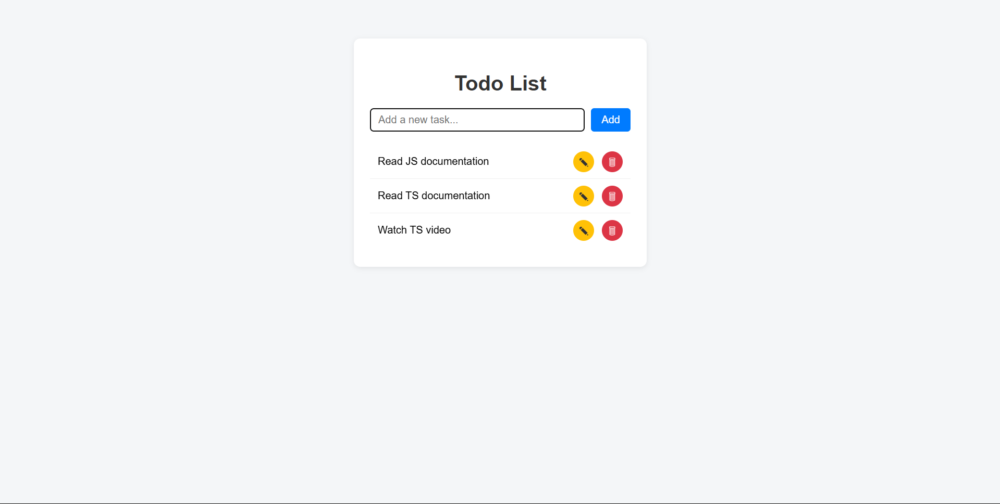
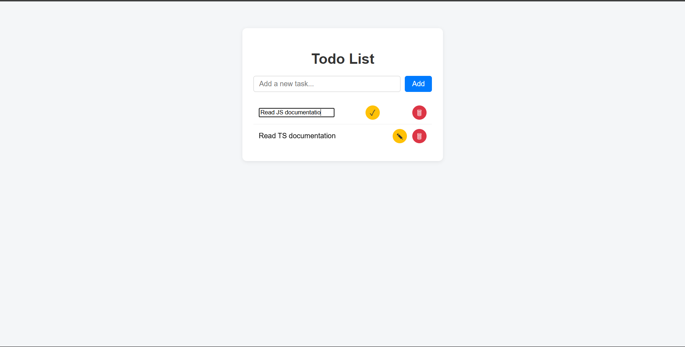
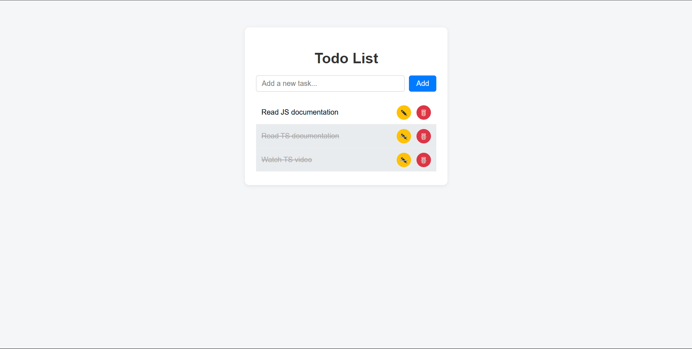

# Project Description

This is a simple Todo List web application built with TypeScript. Users can add, edit, delete, and mark tasks as completed. The app demonstrates modern TypeScript and DOM manipulation best practices.

- `index.html`: The main HTML structure for the app.
- `style.css`: Styles for the Todo List interface.
- `todo.ts`: TypeScript logic for adding, editing, deleting, and
- `todo.js`: Compiled JavaScript output from TypeScript.

## Instructions for Running

1. Make sure all files (`index.html`, `style.css`, `todo.ts`, and `todo.js`) are in the same folder.
2. Compile the TypeScript file to JavaScript:
   - Open a terminal in the project folder.
   - Run `tsc todo.ts` (requires TypeScript installed: `npm install -g typescript`).
3. Open `index.html` in any modern web browser (e.g., Chrome, Edge, Firefox).
4. The Todo List app will load and you can start adding, editing, deleting, and completing tasks.

## Screenshots

