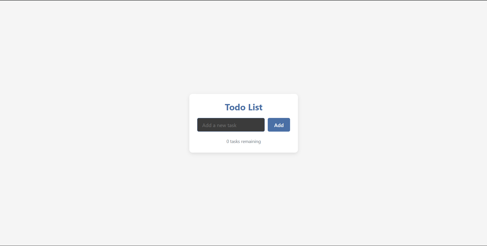
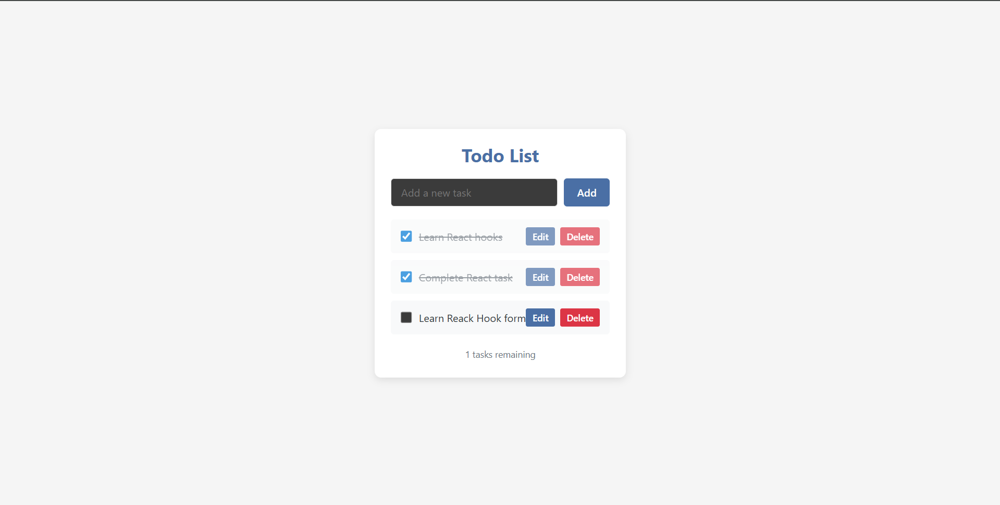
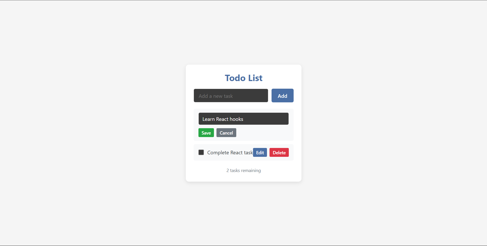
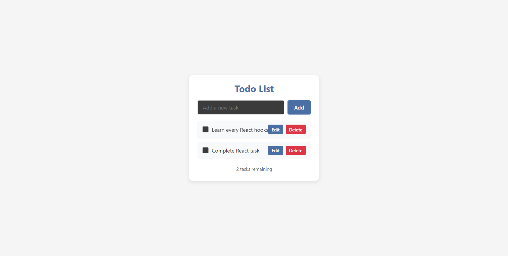

# Project Description

This is a simple Todo List web application built with React and TypeScript. It allows users to add tasks, view them in a list, edit, complete, and delete their daily to-dos. The project is organized into reusable components for better structure and maintainability.

The main files and folders include:

- `index.html`: The main HTML entry point for the app.
- `src/App.tsx`: The root React component.
- `src/component/TodoList.tsx`: The main Todo List logic and UI.
- `src/component/TaskList.tsx`: A component for rendering the list of tasks.
- `src/styles.css`: Styles for the Todo List interface.

## Instructions for Running

- Make sure you have Node.js and npm installed.
- In the project folder, run `npm install` to install dependencies.
- Start the development server with `npm run dev`.
- Open the provided local URL (usually http://localhost:5173) in any modern web browser (e.g., Chrome, Edge, Firefox).
- The Todo List app will load and you can start adding, editing, completing, and deleting tasks.

## Screenshots

