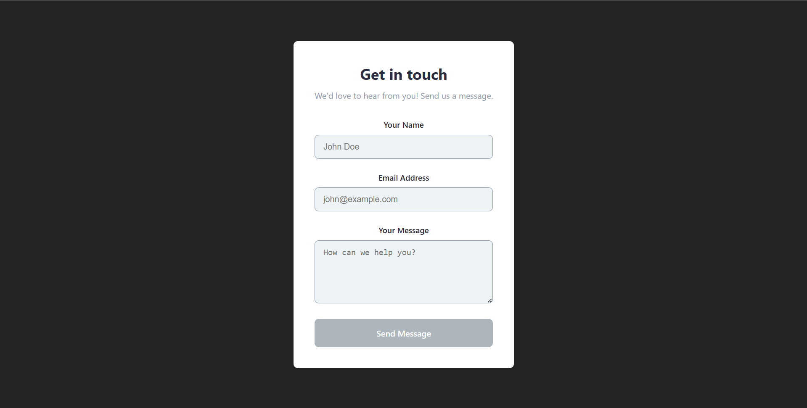
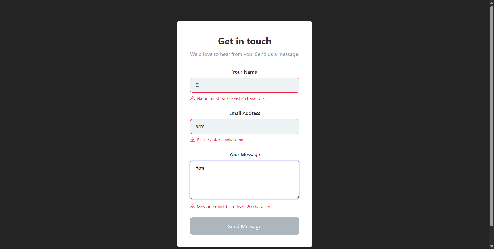
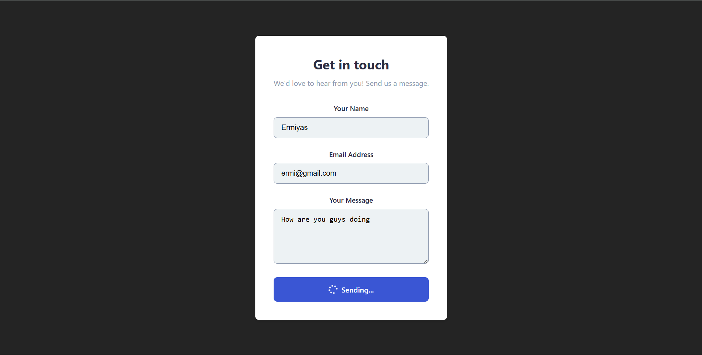

# Project Description

This is a simple Contact Form web application built with React and React Hook Form. It allows users to send messages by entering their name, email, and message. The form includes validation, error messages, and a modern UI with icons.

The main files and folders include:

- `index.html`: The main HTML entry point for the app.
- `src/components/ContactForm.tsx`: The main contact form logic and UI.
- `src/components/FormInput.tsx`: A reusable input component for form fields.
- `src/components/ContactForm.css`: Styles for the contact form interface.

## Instructions for Running

- Make sure you have Node.js and npm installed.
- In the project folder, run `npm install` to install dependencies.
- Start the development server with `npm run dev`.
- Open the provided local URL (usually http://localhost:5173) in any modern web browser (e.g., Chrome, Edge, Firefox).

## Screenshots

