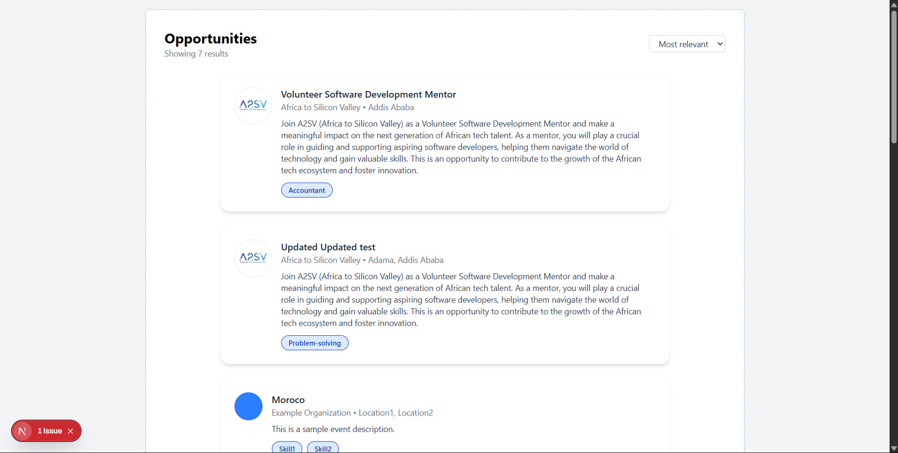
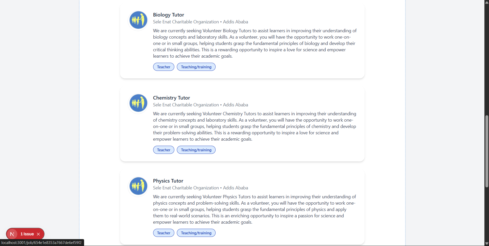
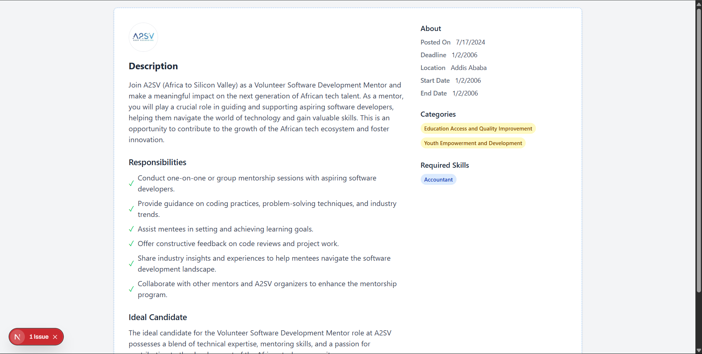
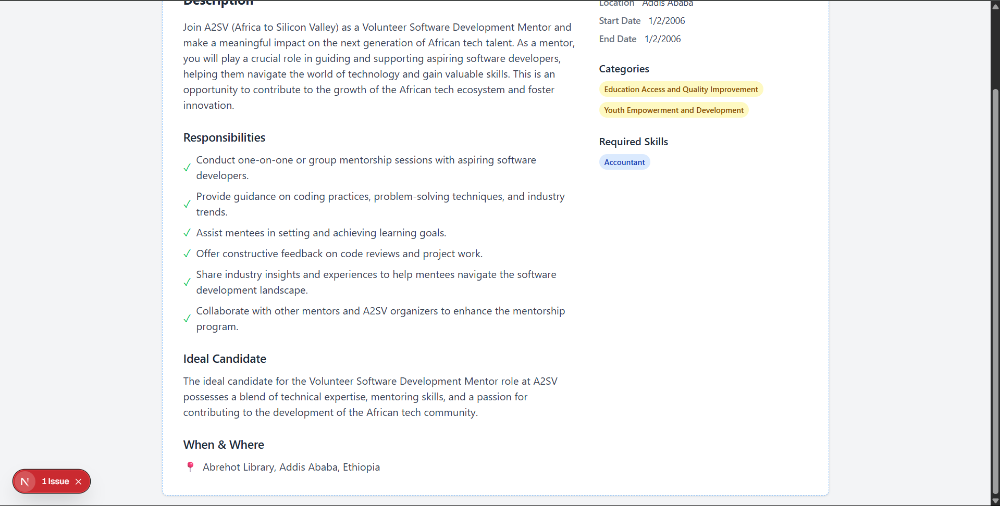

# Project Description

This is a responsive Job Listing web application built with Next.js, React, and Tailwind CSS. It displays a list of job opportunities fetched from an API, allows users to view detailed job descriptions, and features modern UI components with dynamic routing.

The main files and folders include:

- `app/page.tsx`: The main job listing page displaying all opportunities.
- `app/job/[id]/page.tsx`: The dynamic job detail page for each opportunity.
- `app/_components/JobCard.tsx`: The reusable job card component for listing jobs.
- `app/services/api/jobApi.ts`: API logic for fetching job data.
- `app/types/job.ts`: TypeScript types for job data.
- `public/`: Static assets and images.

## Instructions for Running

- Make sure you have Node.js and npm installed.
- In the project folder, run `npm install` to install dependencies.
- Start the development server with `npm run dev`.
- Open the provided local URL (usually http://localhost:3000) in any modern web browser (e.g., Chrome, Edge, Firefox).

## Screenshots

