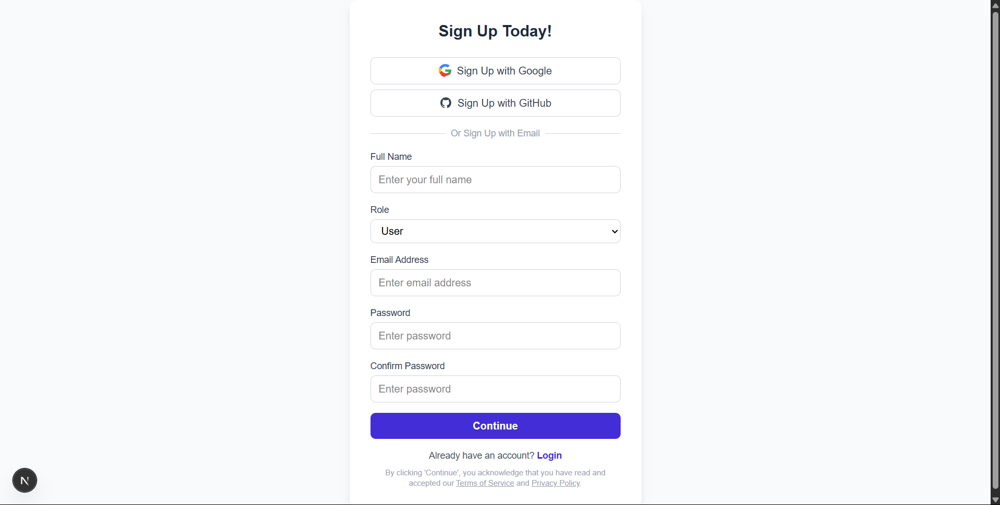
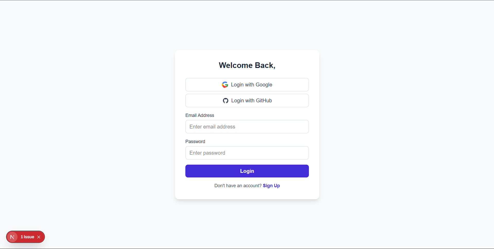
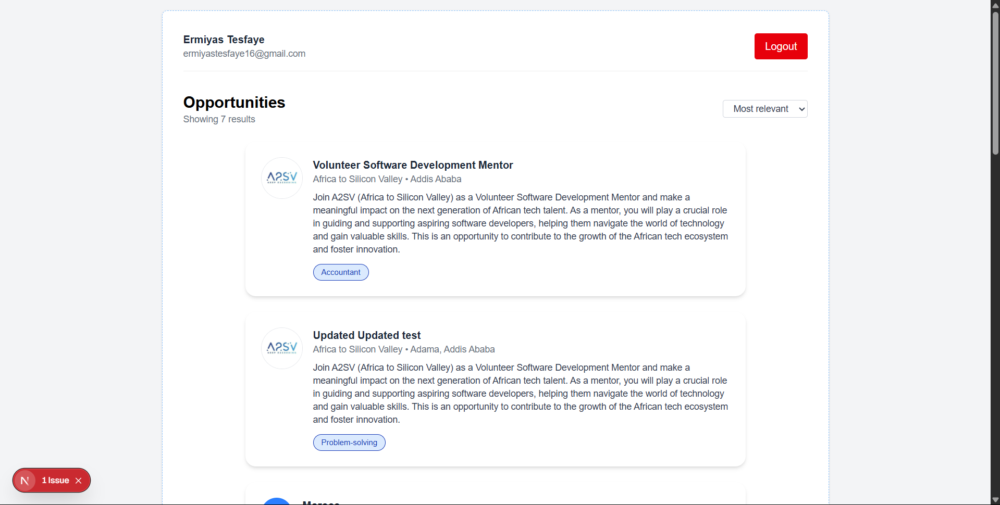

# Authentication

This application features secure authentication using NextAuth.js. Users can sign up with their email and password, verify their email address via a one-time code, and log in using their credentials. Social login options with Google and GitHub are also available for quick access.

Key authentication features:

- Email/password signup and login
- Email verification with OTP
- Social login with Google and GitHub
- Error handling and feedback for failed login or verification

Authentication logic is implemented in:

- `app/login/page.tsx`: Login form and social login buttons
- `app/signup/page.tsx`: Signup form and redirect to email verification
- `app/verify-email/page.tsx`: Email verification with OTP input
- `app/api/auth/[...nextauth]/options.ts`: NextAuth.js configuration and providers

# Project Description

This is a responsive Job Listing web application built with Next.js, React, and Tailwind CSS. It displays a list of job opportunities fetched from an API, allows users to view detailed job descriptions, and features modern UI components with dynamic routing.

The main files and folders include:

- `app/page.tsx`: The main job listing page displaying all opportunities.
- `app/job/[id]/page.tsx`: The dynamic job detail page for each opportunity.
- `app/_components/JobCard.tsx`: The reusable job card component for listing jobs.
- `app/services/api/jobApi.ts`: API logic for fetching job data.
- `app/types/job.ts`: TypeScript types for job data.
- `public/`: Static assets and images.

## Instructions for Running

- Make sure you have Node.js and npm installed.
- In the project folder, run `npm install` to install dependencies.
- Start the development server with `npm run dev`.
- Open the provided local URL (usually http://localhost:3000) in any modern web browser (e.g., Chrome, Edge, Firefox).

## ScreenShots

