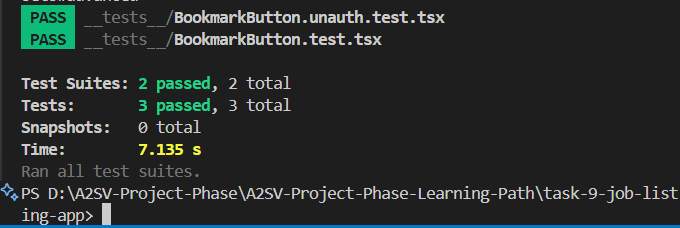

# Project Description

This project is a modern Job Listing web application built with Next.js, React, and Tailwind CSS, featuring secure authentication via NextAuth.js. Users can browse a curated list of job opportunities, view detailed job descriptions, and bookmark jobs for later reference. The application supports both traditional email/password authentication (with email verification) and social login options (Google and GitHub) for a seamless user experience.

Key features include:

- Responsive design for desktop and mobile
- Secure authentication and email verification
- Social login with Google and GitHub
- Bookmarking system to save favorite jobs
- Dynamic routing for job details and user bookmarks
- Error handling and user feedback throughout the app

The main files and folders include:

- `app/page.tsx`: Main job listing page displaying all opportunities
- `app/job/[id]/page.tsx`: Dynamic job detail page for each opportunity
- `app/bookmarks/page.tsx`: Bookmarked jobs page for authenticated users
- `app/_components/JobCard.tsx`: Reusable job card component
- `app/_components/BookmarkButton.tsx`: Bookmark toggle button
- `app/services/api/jobApi.ts` and `app/services/api/bookmarkApi.ts`: API logic for jobs and bookmarks
- `app/types/job.ts`: TypeScript types for job data
- `public/`: Static assets and images

## Instructions for Running

- Ensure Node.js and npm are installed.
- Run `npm install` in the project folder to install dependencies.
- Start the development server with `npm run dev`.
- Open http://localhost:3000 in your browser to use the app.

## Testing

This project uses Cypress for end-to-end testing.

To run the tests:

- Make sure the development server is running (`npm run dev`).
- In a new terminal, run `npx cypress open` to launch the Cypress Test Runner, or `npx cypress run` to run all tests in headless mode.
- Tests are located in the `cypress/e2e/` directory.

You may need to update the test credentials in `cypress/support/commands.js` to match a valid user in your database.

## Unit Testing

This project also uses Jest for unit testing React components and utility functions.

To run the Jest tests:

- Make sure dependencies are installed (`npm install`).
- Run `npm test` or `npx jest` in the project folder.
- Test files are typically located alongside the components or in the `__tests__/` directory.

You can configure or add more tests in the `jest.config.js` file and by creating files with the `.test.ts` or `.test.tsx` extension.

## Screenshots

